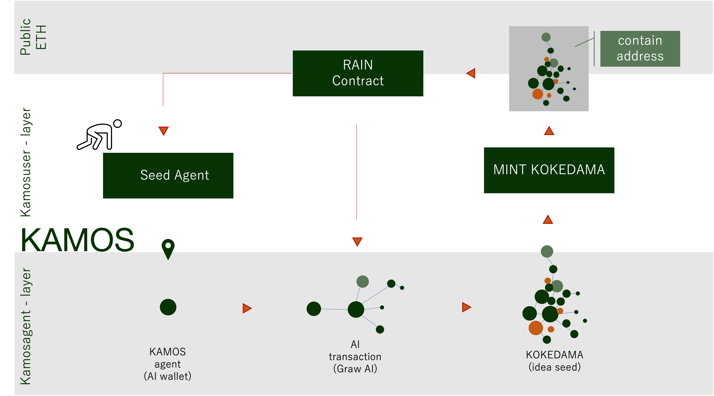

# KAMOS-chain
## Product Image

## Overview
KAMOS-chainは、ユーザーのプライベートチェーン内で成長するアイディアAI : KAMOSを運用するための階層的な基盤チェーンである.

public(ETH-NFT) | kamosuser(substrain) -> kamosaget(substrain) の3階層で構成され.kamosagent内の取引は、全てAIによる取引のみで構成される.

kamosagentは、walletに含まれるkamosuserのアイディア(シードとして利用)を元に、類似のagentを探索し、交配することで新しいアイディアを成長させていく(新規walletの自動発行, initsupply あり).この時、類似agentの探索は、kamosuser間を跨いで実行される.(Private 自動DEX)

kamosagent層がAIのみでトランザクションが発生することから、トークンのトランスファーを可視化することによって、アイディアの構造と、生産された時系列、関係性を可視化していくことができる.つまり、kamosagentmの集合( KOKEDAMA )が、アイディアの構造を表すものとして複数人のkamosuserの寄与度を示すマップとして取り扱える.

kamosuserは、アイディアの構造を表すKOKEDAMAをNFTとしてpublicな領域にMINTすることで、ETHの獲得を実行することができる.この時NFTにふぞくさせるスマートコントラクトによって、KOKEDAMAの構造に基づいて、kamosuser / kamosagentに報酬が分配される.(Rain)

これらの階層性ブロックチェーンとAIによる自動取引、AIトランザクションを元にしたNFTと還元スマートコントラクトによって、継続的にKAMOS-XXのチェーン内に存在するtoken量が増えていく形を構成する.
- [designdoc](./designdocs.md)

## Install and Build
- [setup](./setup.md)

### 使用したtech stacks
- RUST
- React

### 使用したBlockchain
- substrains-v1.0 base 
- substrains(latest)

## Desc for Hackathon
### Technicality
> 取り組んでいる問題の複雑さ、またはその解決へのアプローチとは？
1. 権力分散性の問題:  
DAOにおいてユーザー対ユーザーによる投票権形式の場合、コントラクトがより自分に有意になることを目指すリワードが発生する。これを追加以外で干渉することができないプライベートチェーンを作成（kamosagent)、自動取引ウォレットだけどすることで、ユーザーが干渉するためにはプライベートチェーンに追加していくことしかできない形にした.

2. 取引そのものへの価値付:  
KAMOSは、トークンのトランザクションがkamosagent-walletに紐ずく小さな知識構造の類似度から行われるように設計を進めている。これによって、トークンのトランザクションは、知識構造の自己組織化と、知識構造の発生順位を明確に担保するものになる。ブロックチェーンのトランスファーをNFT（苔玉）にすることで、アイディアの集合に対して投資をできるようにしていきたい。

3. トークンの価値暴落の課題:GameFiにおけるトークンの価値のボラリティの高さは、新規ユーザー特に若年層のユーザーの算入に課題と感じている.今回のKAMOSトークンでは、AIのプライベートチェーンを導入し、AIプライベートチェーンに価値が流入していくことで、通過価値のペグをAI wallet数にすることを目指している

### Originality
> 新しい問題や未解決の問題に取り組んでいるか、既存の問題に対してユニークで創造的な解決策を生み出しているか？
1. BlockChainのAI walletに意味付けすることで、経済トランザクションそのものに価値をつけることを目指した.
これは、今回の知識構造だけでなく、物理現象のwalletを用意すれば、一時的なwalletの追加(これを魔法とする)によって、局所的にゲーム内ルールにwalletの偏りを発生させ、シミュレーション結果を変化させるような運用が可能になる.

2. Block Chain NFTであることから、オークション落札時の自動Transferを実行するための重み空間として活用可能である.(RAIN Contract)これによって、自動で収入が発生するため、自分以外のMintに対してポジティブに評価することができる.
### Practicality
> プロジェクトの完成度や機能性はどうか？想定される利用者が使用できる状態になっているか？
今回のハッカソンでは、kamosuser / kamosagentのブロックチェーンを実装することをメインとしている.
0. public ネットワーク : KOKEDAMA NFTのミントは、実装対象外
1. kamosuser ネットワーク : 
    - substrainsn のプライベートチェーンは実装されている
2. kamosagent ネットワーク :
    - wallet へのアイディア情報の紐付け : 実装中
    - wallet へのkamosuserの紐付け : 実装中
    - walletによるwalletの自動生成機能 : 未実装
    - transfer の可視化 ： 未実装
    
### Usability (UI/UX/DX)
> プロジェクトは使いやすいか？ユーザーとの摩擦をなくすための努力がなされているか？
- 新規ユーザーが参入しやすいように、kamosagentの作成にはコストがかからない形にしている
- 入力していくことで、相互作用、自動でのスケーリングが加速していくため、kamosagentを追加していくことにインセンティブがある
- Kamosuserは自分のアイディアストアとしてkamosagentネットワークを使うため、普段は暗号資産であることに大きな意識を咲かないで済む
- Kamosuserは、NFTをミントすることで自分のアイディアについて投資 / 権利を確定することができる

### WOW factor
> 従来のプロダクトにはもたらし得なかった新しい視点はあるか？
- Block ChainのTransferそのものに意味を持たせNFT化することで、継続的に成長可能なブロックチェーンとすること
- Userが直接Transferを行わないため、Block Chainの取引の遅さが問題にならない.

## Reference Project
- substrate project template was used for create custom build block chain
    -  https://github.com/substrate-developer-hub/substrate-node-template
    - https://github.com/substrate-developer-hub/substrate-module-template
